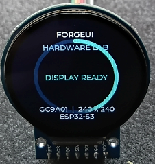

# ForgeUI GC9A01 240x240 Round Display

This is the official ForgeUI Hardware Lab baseline for an ESP32-S3 N16R8 driving a 1.28-inch, 240x240 round GC9A01 TFT. It is developed by [RTechAI](https://github.com/RTechAI) as a cloneable foundation for ForgeUI Micro Projects and Micro Games.

RTechAI develops ForgeUI. ForgeUI Hardware Lab provides physically tested ESP32 hardware references; this repository is the GC9A01 round-display platform.

## Validation status

- **Low-level display:** physically proven.
- **PSRAM:** physically validated — 8 MiB octal PSRAM is detected and the current mapped-memory configuration boots stably.
- **ForgeUI alive showcase:** physically validated by Scott.

## Hardware

- ESP32-S3 DevKitC-1, N16R8-class: 16 MiB flash and 8 MiB PSRAM
- GC9A01 1.28-inch round SPI TFT, 240x240
- No MISO connection and no separate backlight pin

## Locked display wiring

| GC9A01 | ESP32-S3 |
| --- | --- |
| VCC | 3.3V |
| GND | GND |
| SCL / SCLK | GPIO10 |
| SDA / MOSI | GPIO11 |
| DC | GPIO12 |
| CS | GPIO13 |
| RST | GPIO14 |
| MISO | Unused |

GPIO10-GPIO14 are the physically proven flat-ribbon display connection. Do not change them.

## Software baseline

- ESP-IDF 5.5.4
- LVGL 8.3.11
- `espressif/esp_lcd_gc9a01` 1.2.0
- SPI2, mode 0, 20 MHz, RGB565 with `CONFIG_LV_COLOR_16_SWAP=y`
- 16 MiB DIO flash at 80 MHz
- 8 MiB auto-detected octal PSRAM at 80 MHz DDR
- `CONFIG_SPIRAM_USE_MEMMAP=y`: PSRAM is initialized and mapped, but intentionally not added to the malloc heap for this validated baseline

The application presents a lightweight LVGL-only ForgeUI alive screen: a circular animated readiness ring and the display/platform identity. No external assets are required.

## Physical Validation Record

| Image | Evidence |
| --- | --- |
| [gc9a01-round-alive-boot.png](docs/images/gc9a01-round-alive-boot.png) | ForgeUI Hardware Lab startup sequence on the ESP32-S3 N16R8. |
| [gc9a01-round-alive-showcase.png](docs/images/gc9a01-round-alive-showcase.png) | Animated ForgeUI GC9A01 LVGL alive showcase. |
| [gc9a01-round-hardware-validation.png](docs/images/gc9a01-round-hardware-validation.png) | Physical GC9A01 240x240 round-display hardware evidence. |



## Build and flash

Use ESP-IDF 5.5.4 with the board connected:

```powershell
idf.py build
idf.py -p COMx flash
idf.py -p COMx monitor
```

Replace `COMx` with the detected port. Use `Ctrl-]` to exit the monitor.

## Related ForgeUI projects

- [ForgeUI-P4](https://github.com/RTechAI/ForgeUI-P4) — ESP32-P4 LVGL hardware baseline and framework.
- [ForgeUI](https://forgeui.co.nz/) — ForgeUI platform.
- [ForgeUI Studio](https://studio.forgeui.co.nz/) — visual embedded UI workflow.

## Attribution

This baseline began from [UsefulElectronics/esp32s3-gc9a01-lvgl](https://github.com/UsefulElectronics/esp32s3-gc9a01-lvgl). Its unrelated application code and generated UI assets were removed from the active baseline. Upstream attribution remains in the retained GC9A01 header. ESP-IDF, LVGL, and the managed GC9A01 component remain subject to their own licences and notices.
